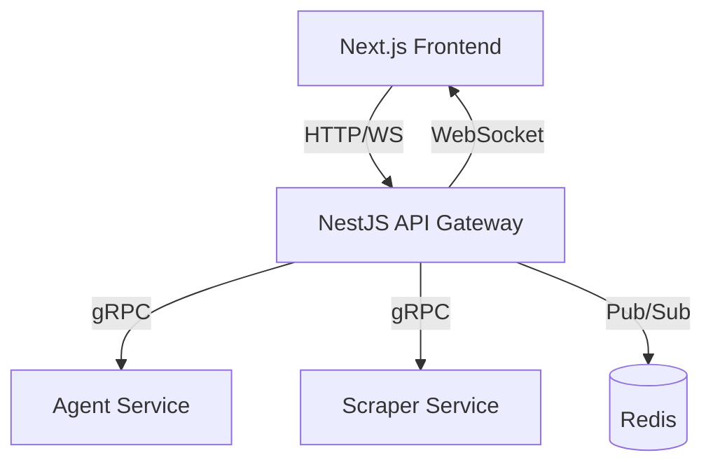

# Daveloper API Gateway

NestJS-powered API Gateway for the Daveloper.dev portfolio platform. Handles real-time WebSocket streaming, gRPC communication with microservices, and REST endpoints.

## 🏗️ Architecture



## ✨ Features

- **🔌 WebSocket Gateways**: Real-time streaming for logs (`/ws/logs`) and chat (`/ws/chat`)
- **🚀 gRPC Clients**: Communication with Agent and Scraper microservices
- **📡 Redis Pub/Sub**: Message broker for real-time token streaming
- **🛠️ REST Endpoints**: `/api/scrape` for job creation, `/api/health` for monitoring
- **💚 Health Checks**: Comprehensive service health monitoring
- **🔧 Error Handling**: Graceful error handling with proper HTTP status codes

## 🚀 Quick Start

### Prerequisites

- Node.js 18+ (warnings for Node 20+ but works with 18)
- Redis server running on localhost:6379
- Agent Service running on localhost:50052
- Scraper Service running on localhost:50051

### Installation

```bash
# Install dependencies
npm install

# Build the application
npm run build

# Start development server
npm run start:dev

# Start production server
npm start
```

### Environment Configuration

Copy `env.example` to `.env` and configure:

```bash
# Server
PORT=3001
FRONTEND_URL=http://localhost:3000

# Redis
REDIS_URL=redis://localhost:6379

# gRPC Services
GRPC_AGENT_URL=localhost:50052
GRPC_SCRAPER_URL=localhost:50051

# Optional: Supabase
SUPABASE_URL=your_supabase_url
SUPABASE_KEY=your_supabase_key
```

## 📋 API Documentation

### REST Endpoints

#### `POST /api/scrape`
Start a new scraping job.

**Request:**
```json
{
  "source": "string",
  "maxArticles": 10,
  "categories": ["tech", "news"]
}
```

**Response:**
```json
{
  "jobId": "uuid",
  "status": "queued",
  "message": "Scrape job has been queued successfully"
}
```

#### `GET /api/health`
Get overall system health.

**Response:**
```json
{
  "status": "ok",
  "timestamp": "2025-01-01T00:00:00.000Z",
  "services": {
    "redis": true,
    "agent": true,
    "scraper": true,
    "supabase": true
  }
}
```

#### Individual Health Checks
- `GET /api/health/redis` - Redis health
- `GET /api/health/agent` - Agent Service health  
- `GET /api/health/scraper` - Scraper Service health

### WebSocket Endpoints

#### `/ws/logs`
Real-time log streaming from scraping jobs.

**Message Format:**
```json
{
  "jobId": "uuid",
  "timestamp": "2025-01-01T00:00:00.000Z",
  "msg": "Fetched 10 articles",
  "level": "info"
}
```

#### `/ws/chat`
Real-time chat with AI agent.

**Send Message:**
```json
{
  "message": "Hello, how can you help me?",
  "sessionId": "unique-session-id",
  "useTools": true,
  "maxTokens": 4096
}
```

**Receive Tokens:**
```json
{
  "sessionId": "unique-session-id",
  "token": "Hello! I'm",
  "done": false,
  "metadata": {
    "toolCalls": [],
    "sources": [],
    "reasoning": ""
  }
}
```

## 🧪 Testing

```bash
# Run tests
npm test

# Run tests with coverage
npm run test:cov

# Run tests in watch mode
npm run test:watch
```

## 🏗️ Development

### Project Structure

```
src/
├── gateways/          # WebSocket gateways
│   ├── chat.gateway.ts
│   └── logs.gateway.ts
├── services/          # Business logic services
│   ├── redis.service.ts
│   ├── agent.service.ts
│   └── scraper.service.ts
├── modules/           # NestJS modules
│   ├── redis.module.ts
│   ├── agent.module.ts
│   └── scraper.module.ts
├── types/             # TypeScript interfaces
│   └── messages.ts
├── proto/             # gRPC protocol definitions
└── test/              # Integration tests
```

### Scripts

- `npm run start:dev` - Development with hot reload
- `npm run start:debug` - Development with debugger
- `npm run build` - Build for production
- `npm start` - Start production server
- `npm test` - Run tests
- `npm run lint` - Lint code
- `npm run format` - Format code

## 🔌 Integration

### With Frontend (Next.js)

```typescript
// WebSocket connection for logs
const logSocket = io('http://localhost:3001/ws/logs');
logSocket.on('log', (data) => {
  console.log(`[${data.level}] ${data.msg}`);
});

// WebSocket connection for chat
const chatSocket = io('http://localhost:3001/ws/chat');
chatSocket.emit('chat', {
  message: 'Hello!',
  sessionId: 'my-session',
  useTools: true
});
```

### With Microservices

The gateway automatically connects to:
- **Agent Service** (gRPC): Handles AI chat requests
- **Scraper Service** (gRPC): Manages news scraping jobs
- **Redis**: Pub/Sub for real-time streaming

## 🚨 Error Handling

The API Gateway provides comprehensive error handling:

- **400 Bad Request**: Invalid request parameters
- **503 Service Unavailable**: Microservice connection issues
- **WebSocket Errors**: Sent as error events with proper codes

## 📊 Monitoring

Health checks are available at:
- `/api/health` - Overall system status
- `/api/health/redis` - Redis connectivity
- `/api/health/agent` - Agent Service status
- `/api/health/scraper` - Scraper Service status

## 🔒 Security

- CORS enabled for frontend origins
- Input validation on all endpoints
- Graceful error handling (no sensitive data leaks)
- Health check rate limiting (planned)

## 🐳 Docker Support

```dockerfile
# Build stage
FROM node:18-alpine AS builder
WORKDIR /app
COPY package*.json ./
RUN npm ci --only=production

# Production stage
FROM node:18-alpine
WORKDIR /app
COPY --from=builder /app/node_modules ./node_modules
COPY dist ./dist
EXPOSE 3001
CMD ["node", "dist/main.js"]
```

## 🤝 Contributing

1. Fork the repository
2. Create your feature branch (`git checkout -b feature/amazing-feature`)
3. Commit your changes (`git commit -m 'Add amazing feature'`)
4. Push to the branch (`git push origin feature/amazing-feature`)
5. Open a Pull Request

## 📄 License

This project is licensed under the MIT License. 